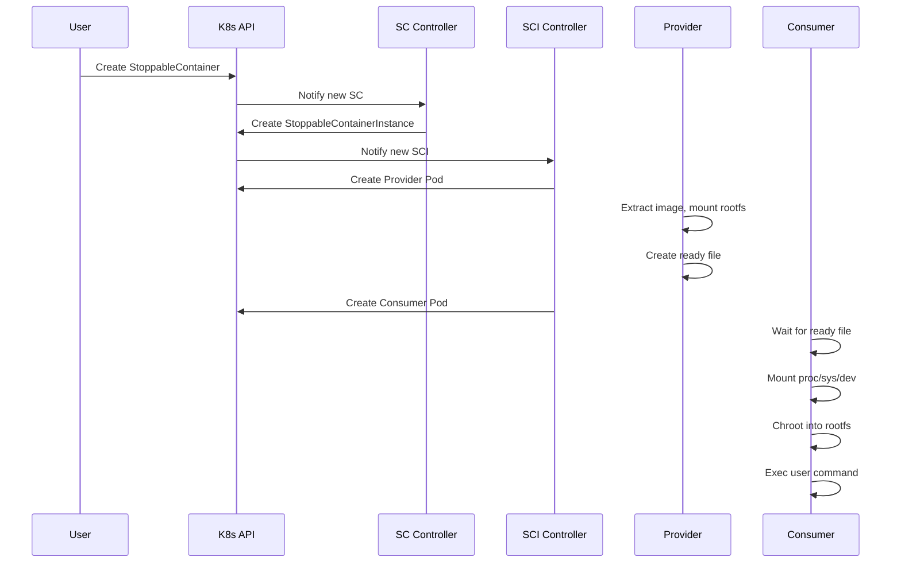
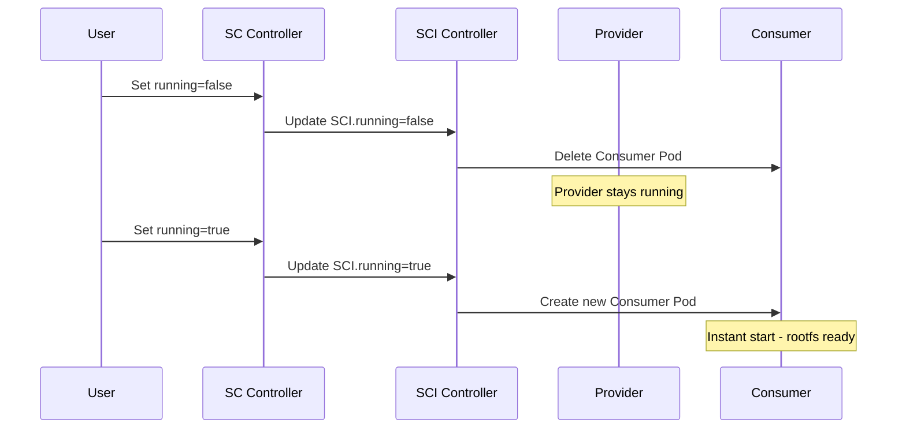

# Architecture

This document explains the architectural design of StoppableContainer.

## Overview

StoppableContainer is designed as a Kubernetes operator that separates container lifecycle management from the root filesystem. This enables near-instant container starts by keeping the filesystem pre-extracted and mounted.

## Components

### Custom Resource Definitions (CRDs)

StoppableContainer introduces two CRDs:

#### StoppableContainer

The user-facing API for defining stoppable containers:

```yaml
apiVersion: stoppablecontainer.xtlsoft.top/v1alpha1
kind: StoppableContainer
metadata:
  name: my-app
spec:
  running: true
  template:
    container:
      image: nginx:latest
```

#### StoppableContainerInstance

An internal resource created by the controller to manage the actual pods:

```yaml
apiVersion: stoppablecontainer.xtlsoft.top/v1alpha1
kind: StoppableContainerInstance
metadata:
  name: my-app
spec:
  running: true
  node: "worker-1"
  template:
    # Copied from StoppableContainer
```

### Controller Manager

The controller manager watches for StoppableContainer and StoppableContainerInstance resources:

```
┌─────────────────────────────────────────────────────────────────┐
│                    Controller Manager                            │
├──────────────────────────┬──────────────────────────────────────┤
│  StoppableContainer      │  StoppableContainerInstance          │
│  Controller              │  Controller                          │
│  ────────────────────    │  ────────────────────────────        │
│  • Watch SC resources    │  • Watch SCI resources               │
│  • Create/update SCI     │  • Create/update Provider Pod        │
│  • Sync status           │  • Create/delete Consumer Pod        │
│                          │  • Update status                     │
└──────────────────────────┴──────────────────────────────────────┘
```

### Pod Architecture

Each StoppableContainerInstance creates two pods:

#### Provider Pod

The provider pod runs continuously and is responsible for:

1. **Extracting the container image** to a known path
2. **Sharing the rootfs** via HostPath volumes
3. **Signaling readiness** to consumer pods

Structure:

```
┌─────────────────────────────────────────┐
│              Provider Pod                │
├─────────────────┬───────────────────────┤
│  pause          │  provider             │
│  container      │  container            │
│  ────────────   │  ────────────────     │
│  Holds network  │  • Extracts image     │
│  namespace      │  • Mounts rootfs      │
│                 │  • Creates ready file │
│                 │  • Runs forever       │
└─────────────────┴───────────────────────┘
        │
        │ HostPath: /var/lib/stoppable-container/{instance}
        ▼
┌─────────────────────────────────────────┐
│              Consumer Pod                │
├─────────────────┬───────────────────────┤
│  exec-wrapper   │  consumer             │
│  init           │  container            │
│  ────────────   │  ────────────────     │
│  Copies exec    │  • Waits for rootfs   │
│  wrapper binary │  • Mounts proc/sys    │
│                 │  • Chroots into rootfs│
│                 │  • Execs user command │
└─────────────────┴───────────────────────┘
```

## Data Flow

### Container Creation Flow



### Stop/Start Flow



## Storage Architecture

### HostPath Volume

The rootfs is shared between provider and consumer using a HostPath volume:

```
/var/lib/stoppable-container/
└── {instance-name}/
    ├── rootfs/          # Extracted container filesystem
    ├── ready            # Signal file indicating rootfs is ready
    └── rootfs-pid       # PID file for cleanup
```

### Mount Propagation

The provider pod uses **Bidirectional** mount propagation to expose the rootfs:

```yaml
volumeMounts:
  - name: rootfs-host
    mountPath: /rootfs
    mountPropagation: Bidirectional
```

The consumer pod uses **HostToContainer** propagation to receive the mounts:

```yaml
volumeMounts:
  - name: rootfs-host
    mountPath: /rootfs
    mountPropagation: HostToContainer
```

## Security Model

### Provider Pod Security

The provider pod requires privileged mode because:

- Kubernetes requires `privileged: true` for Bidirectional mount propagation
- It needs to mount the container filesystem

### Consumer Pod Security

The consumer pod uses minimal capabilities instead of privileged mode:

| Capability | Purpose |
|------------|---------|
| `SYS_ADMIN` | Mounting proc, sys, dev filesystems |
| `SYS_CHROOT` | Chrooting into the rootfs |

This is a significant security improvement over running fully privileged.

## Reconciliation Logic

### StoppableContainer Controller

```go
func Reconcile(ctx, req) {
    sc := Get StoppableContainer
    
    // Find or create Instance
    sci := Get or Create StoppableContainerInstance
    
    // Sync spec
    sci.Spec = sc.Spec
    Update sci
    
    // Sync status
    sc.Status = sci.Status
    Update sc
}
```

### StoppableContainerInstance Controller

```go
func Reconcile(ctx, req) {
    sci := Get StoppableContainerInstance
    
    // Ensure provider pod
    provider := Get or Create Provider Pod
    if provider not running {
        return Requeue
    }
    
    if sci.Spec.Running {
        // Ensure consumer pod
        consumer := Get or Create Consumer Pod
        Update status to Running
    } else {
        // Delete consumer pod
        Delete Consumer Pod
        Update status to Stopped
    }
}
```

## Next Steps

- [How It Works](how-it-works.md) - Detailed technical explanation
- [Security](security.md) - Security considerations and best practices
