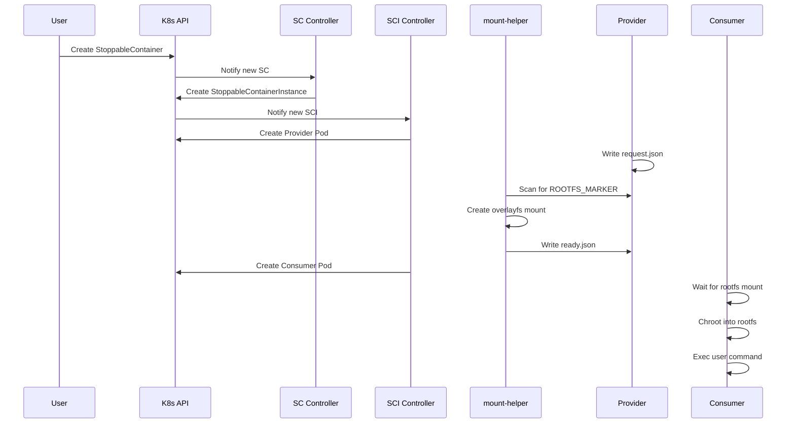
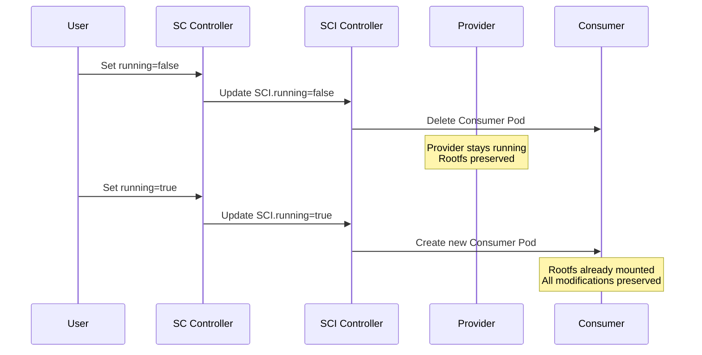

# Architecture

This document explains the architectural design of StoppableContainer.

## Overview

StoppableContainer is designed as a Kubernetes operator that enables containers with **persistent root filesystems**. Unlike regular containers where the root filesystem is ephemeral (lost when the pod is deleted), StoppableContainers preserve the filesystem state across stop/start cycles.

## Key Design Goals

1. **Persistent Rootfs**: All filesystem modifications survive container restarts
2. **Security**: No privileged user workloads - all privileged operations are centralized
3. **Compatibility**: Works with any container image, including scratch/distroless
4. **Kubernetes Native**: Follows operator patterns and integrates seamlessly

## Components

### Custom Resource Definitions (CRDs)

StoppableContainer introduces two CRDs:

#### StoppableContainer

The user-facing API for defining stoppable containers:

```yaml
apiVersion: stoppablecontainer.xtlsoft.top/v1alpha1
kind: StoppableContainer
metadata:
  name: my-app
spec:
  running: true
  template:
    container:
      image: nginx:latest
```

#### StoppableContainerInstance

An internal resource created by the controller to manage the actual pods:

```yaml
apiVersion: stoppablecontainer.xtlsoft.top/v1alpha1
kind: StoppableContainerInstance
metadata:
  name: my-app
spec:
  running: true
  node: "worker-1"
  template:
    # Copied from StoppableContainer
```

### Controller Manager

The controller manager watches for StoppableContainer and StoppableContainerInstance resources:

```
┌─────────────────────────────────────────────────────────────────┐
│                    Controller Manager                            │
├──────────────────────────┬──────────────────────────────────────┤
│  StoppableContainer      │  StoppableContainerInstance          │
│  Controller              │  Controller                          │
│  ────────────────────    │  ────────────────────────────        │
│  • Watch SC resources    │  • Watch SCI resources               │
│  • Create/update SCI     │  • Create/update Provider Pod        │
│  • Sync status           │  • Create/delete Consumer Pod        │
│                          │  • Update status                     │
└──────────────────────────┴──────────────────────────────────────┘
```

### mount-helper DaemonSet

The mount-helper is a **privileged DaemonSet** that runs on every node and handles all mount operations:

```
┌─────────────────────────────────────────────────────────────────┐
│                   mount-helper DaemonSet                         │
│  (One pod per node, privileged)                                 │
├─────────────────────────────────────────────────────────────────┤
│  Responsibilities:                                              │
│  • Scans /proc for provider containers (ROOTFS_MARKER=true)     │
│  • Creates overlayfs mounts from container filesystem           │
│  • Mounts /proc, /dev, /sys for consumer pods                   │
│  • Signals readiness via ready.json                             │
└─────────────────────────────────────────────────────────────────┘
```

**Why a DaemonSet?**

- **Centralized privilege**: Only the DaemonSet runs with elevated privileges
- **Audit**: All mount operations go through a single, auditable component  
- **Security**: User workloads never need CAP_SYS_ADMIN

### Pod Architecture

Each StoppableContainerInstance creates two pods:

#### Provider Pod

The provider pod runs continuously and holds the container's rootfs:

```
┌─────────────────────────────────────────┐
│              Provider Pod                │
│              (NOT privileged)            │
├─────────────────┬───────────────────────┤
│  rootfs         │  provider             │
│  container      │  container            │
│  ────────────   │  ────────────────     │
│  User's image   │  • Writes request.json│
│  + pause binary │  • Waits for ready.json│
│  Holds rootfs   │  • Runs forever       │
└─────────────────┴───────────────────────┘
        │
        │ mount-helper reads container's /proc/<pid>/root
        │ and creates overlayfs mount at hostPath
        ▼
┌─────────────────────────────────────────┐
│              Consumer Pod                │
│              (Only CAP_SYS_CHROOT)       │
├─────────────────┬───────────────────────┤
│  init container │  consumer             │
│  ────────────   │  container            │
│  Copies exec    │  • Mounts hostPath    │
│  wrapper binary │  • Chroots into rootfs│
│                 │  • Execs user command │
└─────────────────┴───────────────────────┘
```

## Data Flow

### Container Creation Flow



### Stop/Start Flow



## Storage Architecture

### HostPath Volume

The rootfs is shared between provider and consumer using a HostPath volume:

```
/var/lib/stoppable-container/
└── {instance-name}/
    ├── rootfs/          # Extracted container filesystem
    ├── ready            # Signal file indicating rootfs is ready
    └── rootfs-pid       # PID file for cleanup
```

### Mount Propagation

The provider pod uses **Bidirectional** mount propagation to expose the rootfs:

```yaml
volumeMounts:
  - name: rootfs-host
    mountPath: /rootfs
    mountPropagation: Bidirectional
```

The consumer pod uses **HostToContainer** propagation to receive the mounts:

```yaml
volumeMounts:
  - name: rootfs-host
    mountPath: /rootfs
    mountPropagation: HostToContainer
```

## Security Model

### DaemonSet-Based Architecture

StoppableContainer uses a centralized security model where all privileged operations are handled by the mount-helper DaemonSet:

| Component | Privilege Level | Notes |
|-----------|----------------|-------|
| mount-helper DaemonSet | Privileged | One per node, centrally managed |
| Provider Pod | **Non-privileged** | No special capabilities needed |
| Consumer Pod | CAP_SYS_CHROOT only | Minimal privilege for chroot |

### Key Security Benefits

1. **No privileged user workloads** - User code never runs with elevated privileges
2. **Centralized audit** - All mount operations go through the DaemonSet
3. **Reduced blast radius** - Compromise of user pod doesn't grant mount capabilities
4. **Pod Security Standards compatible** - Consumer pods can run with restricted PSS

### Consumer Pod Security

The consumer pod uses minimal capabilities:

| Capability | Purpose |
|------------|---------|
| `SYS_CHROOT` | Chrooting into the rootfs |

**Note**: The consumer does NOT need `CAP_SYS_ADMIN` - the DaemonSet handles all mount operations.

## Reconciliation Logic

### StoppableContainer Controller

```go
func Reconcile(ctx, req) {
    sc := Get StoppableContainer
    
    // Find or create Instance
    sci := Get or Create StoppableContainerInstance
    
    // Sync spec
    sci.Spec = sc.Spec
    Update sci
    
    // Sync status
    sc.Status = sci.Status
    Update sc
}
```

### StoppableContainerInstance Controller

```go
func Reconcile(ctx, req) {
    sci := Get StoppableContainerInstance
    
    // Ensure provider pod
    provider := Get or Create Provider Pod
    if provider not running {
        return Requeue
    }
    
    if sci.Spec.Running {
        // Ensure consumer pod
        consumer := Get or Create Consumer Pod
        Update status to Running
    } else {
        // Delete consumer pod
        Delete Consumer Pod
        Update status to Stopped
    }
}
```

## Next Steps

- [How It Works](how-it-works.md) - Detailed technical explanation
- [Security](security.md) - Security considerations and best practices
