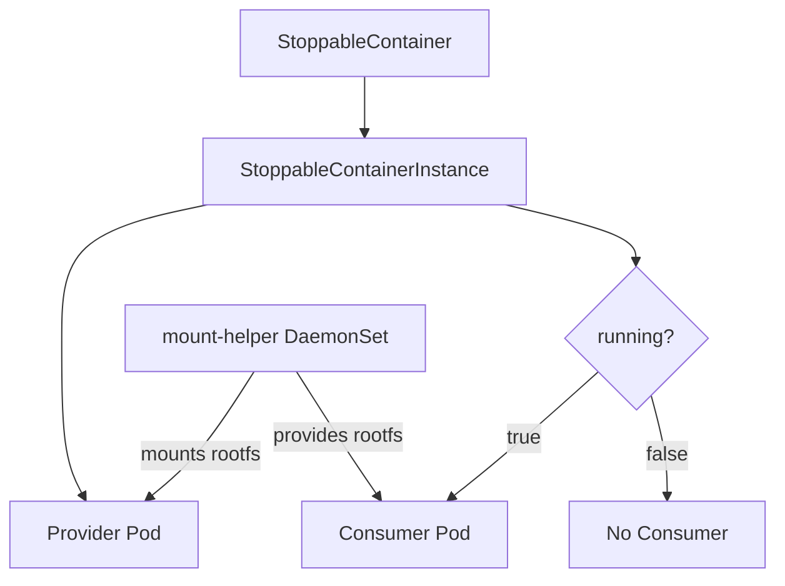

# StoppableContainer

<p align="center">
  <strong>A Kubernetes operator for containers with persistent root filesystems</strong>
</p>

<p align="center">
  <a href="getting-started/installation/">Installation</a> •
  <a href="getting-started/quickstart/">Quick Start</a> •
  <a href="concepts/architecture/">Architecture</a> •
  <a href="api-reference/stoppablecontainer/">API Reference</a>
</p>

---

## What is StoppableContainer?

StoppableContainer is a Kubernetes operator that enables containers with **persistent root filesystems**. Unlike regular containers where the root filesystem is ephemeral (lost when the pod is deleted), StoppableContainers preserve their entire filesystem state across stop/start cycles.

This is particularly useful for scenarios like:

- **Development environments** - Install packages, configure tools, then stop. When you resume, all your changes are still there
- **Stateful workloads** - Maintain filesystem modifications without needing to configure external volumes for every directory
- **Cost optimization** - Stop containers when not in use to save resources, resume with state intact
- **Educational platforms** - Student containers that preserve their work across sessions

## Key Features

- 💾 **Persistent Rootfs**: Container filesystem survives stop/start cycles - all installed packages, config files, and modifications are preserved
- 🔒 **Enhanced Security**: Consumer pods use minimal Linux capabilities instead of full privileged mode
- ⚡ **Simple API**: Just set `running: true` or `running: false` to control container state
- 🔄 **Kubernetes Native**: Follows operator pattern and integrates seamlessly with existing clusters
- 🛠️ **kubectl Plugin**: Easy-to-use CLI for managing StoppableContainers

## How It Works

StoppableContainer uses a DaemonSet-based architecture with three key components:

1. **mount-helper DaemonSet**: Runs on each node, handles privileged mount operations
2. **Provider Pod**: Holds the container's rootfs (non-privileged)
3. **Consumer Pod**: Executes user commands in the rootfs. Created when `running: true`, deleted when `running: false`



## Quick Example

```yaml
apiVersion: stoppablecontainer.xtlsoft.top/v1alpha1
kind: StoppableContainer
metadata:
  name: my-app
spec:
  running: true
  template:
    container:
      image: ubuntu:22.04
      command: ["/bin/bash"]
```

### Using kubectl-sc (recommended)

```bash
# Create and start a container
kubectl sc create my-app --image=ubuntu:22.04 -- /bin/bash

# Install packages (these will persist!)
kubectl sc exec my-app -- apt update
kubectl sc exec my-app -- apt install -y python3 nodejs

# Stop the container (preserves all installed packages)
kubectl sc stop my-app

# Resume later (all your packages are still there)
kubectl sc start my-app
```

### Using kubectl

To stop the container:

```bash
kubectl patch stoppablecontainer my-app --type=merge -p '{"spec":{"running":false}}'
```

To resume:

```bash
kubectl patch stoppablecontainer my-app --type=merge -p '{"spec":{"running":true}}'
```

## Architecture Overview

```
┌─────────────────────────────────────────────────────────────────┐
│                      StoppableContainer CR                       │
├─────────────────────────────────────────────────────────────────┤
│ spec.running: true/false                                         │
│ spec.template: container specification                           │
└────────────────────────────┬────────────────────────────────────┘
                             │
                             ▼
┌─────────────────────────────────────────────────────────────────┐
│                 StoppableContainerInstance CR                    │
│                    (auto-created by controller)                  │
└────────────────────────────┬────────────────────────────────────┘
                             │
              ┌──────────────┴──────────────┐
              ▼                              ▼
┌─────────────────────────┐    ┌─────────────────────────┐
│      Provider Pod        │    │      Consumer Pod        │
│  ├── rootfs container    │    │  ├── init container      │
│  │   (user image+pause)  │    │  │   (copy exec-wrapper)  │
│  └── provider container  │──▶│  └── consumer container  │
│      (request mount)     │    │      (chroot + command)  │
└─────────────────────────┘    └─────────────────────────┘
         Always Running              Created when running=true
                        ▲
                        │ overlayfs mount
┌───────────────────────┴─────────────────────────────────────────┐
│                   mount-helper DaemonSet                         │
│  (Privileged, runs on every node, handles mount operations)     │
└─────────────────────────────────────────────────────────────────┘
```

## Next Steps

- [Install StoppableContainer](getting-started/installation.md)
- [Try the Quick Start guide](getting-started/quickstart.md)
- [Understand the Architecture](concepts/architecture.md)
