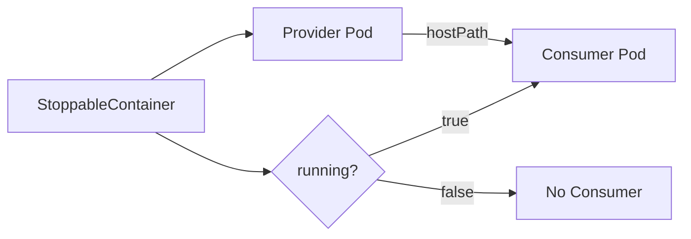

# StoppableContainer

<p align="center">
  <strong>A Kubernetes operator for managing containers with persistent rootfs that can be quickly started and stopped</strong>
</p>

<p align="center">
  <a href="getting-started/installation/">Installation</a> •
  <a href="getting-started/quickstart/">Quick Start</a> •
  <a href="concepts/architecture/">Architecture</a> •
  <a href="api-reference/stoppablecontainer/">API Reference</a>
</p>

---

## What is StoppableContainer?

StoppableContainer is a Kubernetes operator that enables **instant container startup** by keeping the root filesystem (rootfs) ready in the background. When you stop a container, only the user process is terminated while the rootfs remains mounted. When you start it again, the container resumes immediately without needing to re-extract the image layers.

This is particularly useful for scenarios like:

- **Development environments** that need to start and stop frequently
- **Cost optimization** by stopping idle containers while maintaining quick resume times
- **Educational platforms** where student containers are started on-demand
- **Serverless-like workloads** that benefit from warm starts

## Key Features

- 🚀 **Instant Resume**: Start containers in milliseconds instead of seconds
- 💾 **Persistent Rootfs**: Container filesystem survives restarts
- 🔒 **Enhanced Security**: Consumer pods use minimal Linux capabilities instead of full privileged mode
- ⚡ **Simple API**: Just set `running: true` or `running: false` to control container state
- 🔄 **Kubernetes Native**: Follows operator pattern and integrates seamlessly with existing clusters

## How It Works

StoppableContainer uses a two-pod architecture:

1. **Provider Pod**: Runs continuously and exposes the container's rootfs via HostPath
2. **Consumer Pod**: Mounts the rootfs and executes user commands. Created when `running: true`, deleted when `running: false`



## Quick Example

```yaml
apiVersion: stoppablecontainer.xtlsoft.top/v1alpha1
kind: StoppableContainer
metadata:
  name: my-app
spec:
  running: true
  template:
    container:
      image: nginx:latest
      command: ["nginx", "-g", "daemon off;"]
```

To stop the container:

```bash
kubectl patch stoppablecontainer my-app --type=merge -p '{"spec":{"running":false}}'
```

To resume:

```bash
kubectl patch stoppablecontainer my-app --type=merge -p '{"spec":{"running":true}}'
```

## Architecture Overview

```
┌─────────────────────────────────────────────────────────────────┐
│                      StoppableContainer CR                       │
├─────────────────────────────────────────────────────────────────┤
│ spec.running: true/false                                         │
│ spec.template: container specification                           │
└────────────────────────────┬────────────────────────────────────┘
                             │
                             ▼
┌─────────────────────────────────────────────────────────────────┐
│                 StoppableContainerInstance CR                    │
│                    (auto-created by controller)                  │
└────────────────────────────┬────────────────────────────────────┘
                             │
              ┌──────────────┴──────────────┐
              ▼                              ▼
┌─────────────────────────┐    ┌─────────────────────────┐
│      Provider Pod        │    │      Consumer Pod        │
│  ├── pause container     │    │  ├── exec-wrapper-init   │
│  └── provider container  │──▶│  └── consumer container  │
│      (export rootfs)     │    │      (user command)      │
└─────────────────────────┘    └─────────────────────────┘
         Always Running              Created when running=true
```

## Next Steps

- [Install StoppableContainer](getting-started/installation.md)
- [Try the Quick Start guide](getting-started/quickstart.md)
- [Understand the Architecture](concepts/architecture.md)
